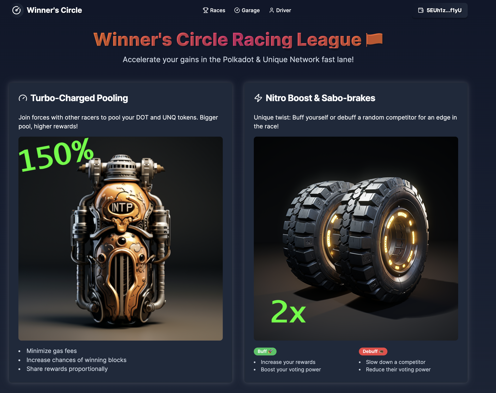
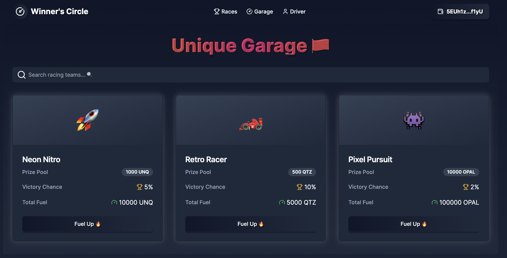
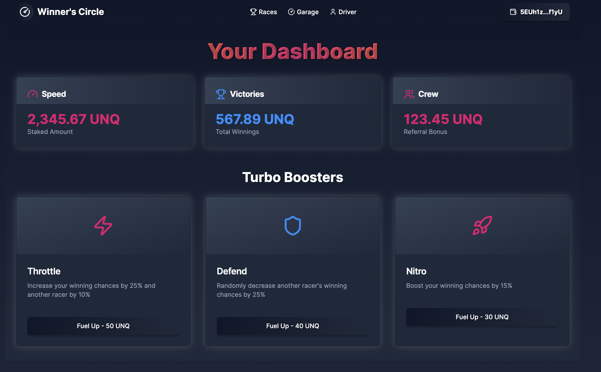

# Winner's Circle Demo

This codebase allows you to launch a winner's circle circuit, create players, and run races to find the staked rewards victor as well as purchase power-ups and distribute rewards to the winners. 

### Before we start

- Create a Substrate account
- Get `OPL` (testnet) tokens: https://t.me/unique2faucet_opal_bot
- Create `.env` from `.env-example` and set your mnemonic phrase
- Run `npm install`

## How it works
Winner's circle is a game for winner's only! Stake your crypto, generate yield rewards, win a prize for each race won. Unstake at anytime, no losses!

The repo is split into the back-end deployment code (main) for creating Unique NFT collections for players/power-ups/trophies, as well as front-end code (gendev1/frontend) for purchasing power-ups, staking into a racing pool, and distributing funds to the victors.

## Front End (gendev1/frontend):

### 1. Navigate to the client directory and install dependencies

```sh
cd client
npm install
```

### 2. Run the server and open http://localhost:3000/dashboard in your browser once it's running

```sh
npm run dev
```

### 3. Connect to the dashboard using a Polkadot wallet and start your engines!

**Races tab (Default)**
- View features
- Overview of how it works
- Join a race (staking pool)



**Garage tab**
- Select your vehicle
- View it's features
- Purchase Unique NFT to augment your odds (In Progress)



**Driver tab**
- Select a boost
- Give yourself a 1 time edge, or thwart your race opponents 
- Purchase Dynamic NFT Boosts to augment your odds (In Progress)



### Back End (main):

Join a staking pool and get a Dynamic player NFT which you can then augment with Nested NFTs that allow you to race with cars with better traits, give you "wheels" which improve your odds of winning the current pool, or "spikes" which sabotage other players. When you win a prize pool your `Victories` counter increases, and for each pool you "race" in the `Experience` counter increments.


Winner's of each race get a unique achievement NFT with the gold medal for your specific race, as well as the staking prize pool of yield rewards!


### Features

- All NFTs are owned by individual users
- The application can modify NFT properties
- Users can modify the properties of their NFTs by purchasing nested NFTs

---


## 1. Create a winner's circle collection

```sh
node ./src/1-collection-cars.js
```

## 2. Create Achievements collection

```sh
node ./src/2-collection-achievement.js
```

## 3. Create at least two winner NFTs

Pass the following arguments to the function
- collectionId (step 1)
- owner Substrate address
- owner nickname

For example:

```sh
node ./src/3-create-car.js 3235 5GrwvaEF5zXb26Fz9rcQpDWS57CtERHpNehXCPcNoHGKutQY EZsoFastBrrr
node ./src/3-create-car.js 3235 5CPuU98SimxwoHZRZCi8hezgnfBwATs8vKo6haqkaP3hUj7X BartFTW
node ./src/3-create-car.js 3235 5CPuU98SimxwoHZRZCi8hezgnfBwATs8vKo6haqkaP3hUj7X SpeedyEswar
```

## 4. Play the game

Pass the following arguments to the function
- Winner's Circle circuit collectionId (step 1)
- Achievements collectionId (step 2)
- First player's tokenId 
- Second player's tokenId
- Additional player's tokenIds

```sh
node ./src/4-play.js 3235 3236 1 2 3
```
