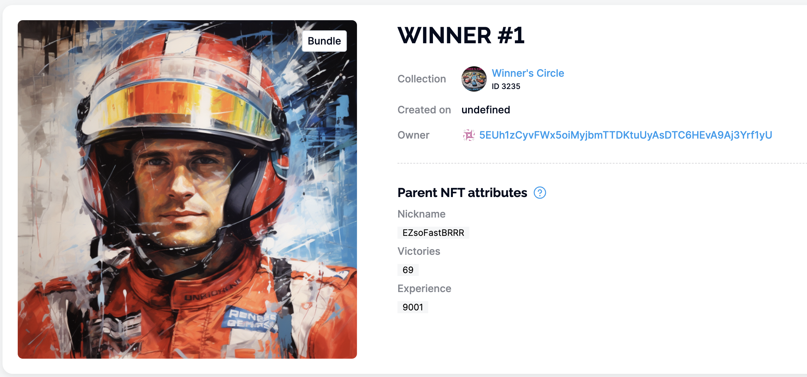
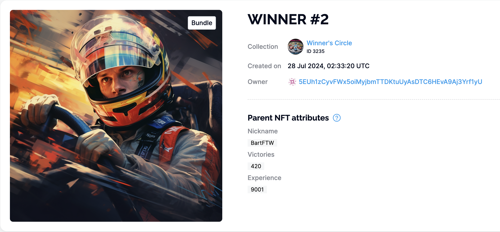
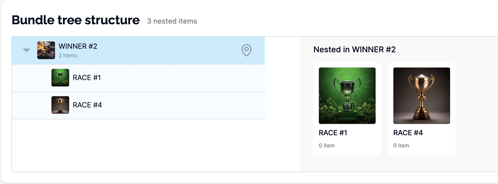

# Unique NFT data management workshop

The workshop demonstrates how to store, manage, and extend data using nested tokens within the Unique Network.

### Before we start

- Create a Substrate account
- Get `OPL` (testnet) tokens: https://t.me/unique2faucet_opal_bot
- Create `.env` from `.env-example` and set your mnemonic phrase
- Run `npm install`

## Legend

Let's create a very simple game. In this game user can mint an NFT that represents racing car. Each NFT starts with an empty record—no wins, no losses.



Players can then compete against each other. When a car wins a race, its `Victories` counter increases. If it loses, the `Defeats` counter increments accordingly.



Exciting achievements can be awarded as well, and these achievements are also NFTs owned by the original racing car NFTs!



### Talking about restrictions

- All NFTs are owned by individual users
- The application can modify NFT properties
- Users cannot directly modify the properties of their NFTs

---


## 1. Create a Racing cars collection

```sh
node ./src/1-collection-cars.js
```

## 2. Create Achievements collection

```sh
node ./src/2-collection-achievement.js
```

## 3. Create at least two car NFTs

Pass the following arguments to the function
- collectionId (step 1)
- owner Substrate address
- owner nickname

For example:

```sh
node ./src/3-create-car.js 3135 5GrwvaEF5zXb26Fz9rcQpDWS57CtERHpNehXCPcNoHGKutQY FastGuy
node ./src/3-create-car.js 3135 5CPuU98SimxwoHZRZCi8hezgnfBwATs8vKo6haqkaP3hUj7X RaceQueen
```

## 4. Play the game

Pass the following arguments to the function
- Cars collectionId (step 1)
- Achievements collectionId (step 2)
- First player's tokenId 
- Second player's tokenId

```sh
node ./src/4-play.js 3132 3133 1 2
```